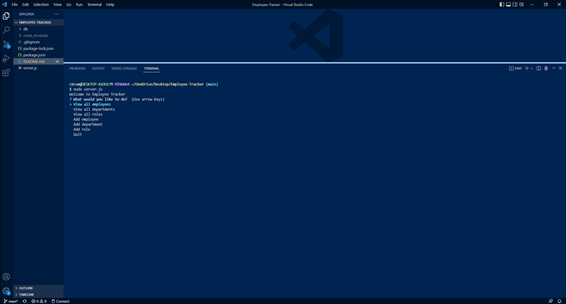
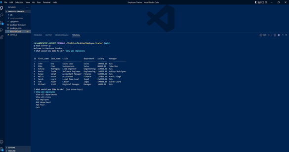

# Employee-Tracker

## Descrpition 
This command-line application allows a user to interact with an employee tracker database. When the command-line application is deployed, the user is presented with a series of questions: View all depamtments, view all roles, view all employees, add a department, add a role, and add an employee. When the buttons are clciked, they will show the corresponding data. The user can view all departments, roles, and employees. They can also add new departments, roles, and employees.

## Installation
* link to walkthrough video: https://youtu.be/KDwMTJ_DRpc
* link to GitHub: https://github.com/ckrum21/Employee-Tracker

Install this website by cloning the code to your local devices.

software required to download this website:
* GitBash or other terminal
* Visual Studio Code

## Usage

The code used for this webpage is HTML, CSS, JavaScript, Node, inquire, and mySQL.

## Credits
Chelsea Krum 